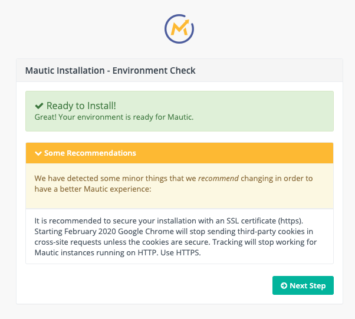
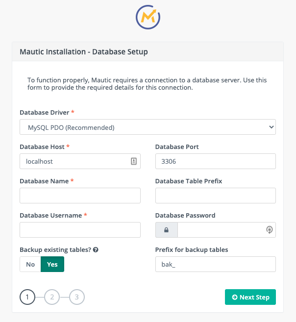
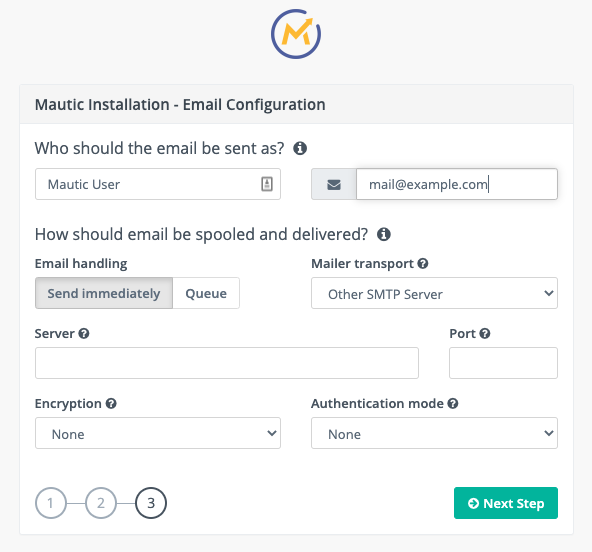
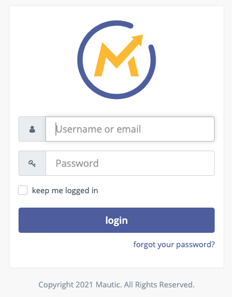

## Installing from the production package
This is the route followed by the majority of Mautic users. Mautic provides a zipped installation package which you can download at [mautic.org/download][download-mautic].

The download is the latest stable release - you can find more information about the available versions of Mautic [here][mautic-releases].

Before proceeding with the installation it's important that you make sure your server environment meets the [minimum requirements][minimum-requirements] for the version you are installing.

It's also strongly recommended that you:

* Check that the directory is writable by the web server
* Check if there is enough free disk space to run the installation - don't forget to factor in the database size
* Ensure PHPs `max_execution_time` is at least 240 seconds

Mautic requires a MySQL/MariaDB database, so make sure that you have created one and have the credentials to hand for the user account with permissions to interact with the database. Remember to verify that the version of MySQL/MariaDB matches the [minimum requirements] [minimum-requirements].

### Uploading the production package
Once you have downloaded the zip file, you need to upload this to your web server and unzip it in the appropriate directory where you would like to host your Mautic instance.

Ensure that the web server has the correct permissions to access the files after you have unzipped them - read the documentation on [working with file and folder permissions][file-permissions].

### Using the web-based installer

Browse to the URL that corresponds to your Mautic instance, ensuring that you are accessing it over a secure connection, for example `https://m.example.com`.

#### Pre-flight checks

The installer displays the first steps of the installation process, including any warnings in orange which you may wish to address.



Highlighted in red are any critical issues that could block installing Mautic.

#### Database configuration

Proceeding with the installation requires entering the appropriate database credentials. If this is a new installation, turn off the option to back up existing tables. Using a database table prefix isn't recommended unless you have a specific reason to do so.



#### Creating the administrator user account
The next step is to create an administrator which is your account for logging into Mautic. Ensure that you use a secure password, ideally randomly generated, to keep your Mautic instance safe.


#### Configuring email settings
The next step involves configuring email settings for your Mautic instance. If you are configuring a local instance for testing, use a tool such as [Mailhog][mailhog] to capture outgoing emails. If you are planning to use this Mautic instance in production, you can enter the details for your email delivery provider.



##### Who should the email be sent as?

Enter the name and email address for the default for outgoing emails. If you use an email provider which requires authorization of outgoing email addresses, ensure this address has been successfully authorized.

##### How should the email be spooled and delivered?

###### Email handling 
With larger instances, queuing emails and having them sent using a timed cron job to trigger the queue processing is recommended, rather than sending immediately. 

###### Mailer transport
If you wish to use an email delivery provider, select from the options available. If your provider isn't listed, select Other SMTP Server and provide the SMTP credentials.

Generally speaking, API-based sending is significantly faster than SMTP.

Depending on which provider you select, additional fields are displayed to enable entering API keys and selecting regions, as appropriate.

Select the encryption and authentication mode that your provider instructs in their documentation.

#### Logging into Mautic

Finally, once all the settings are successfully configured, you arrive at the login page where you can enter the username and password from the previous step, and log into your new Mautic instance.



### Using the command line installer

It's also possible to install Mautic from the command line.

You can either pass the settings parameters in the command, or by having first created a local.php file containing your database settings. You can define properties in local.php with the same syntax expected by the command line options - use the command  `path/to/php bin/console mautic:install --help` for the list of options and flags available.

```
     --db_driver=DB_DRIVER                    Database driver. [default: "pdo_mysql"]
      --db_host=DB_HOST                        Database host.
      --db_port=DB_PORT                        Database port.
      --db_name=DB_NAME                        Database name.
      --db_user=DB_USER                        Database user.
      --db_password=DB_PASSWORD                Database password.
      --db_table_prefix=DB_TABLE_PREFIX        Database tables prefix.
      --db_backup_tables=DB_BACKUP_TABLES      Backup database tables if they exist; otherwise drop them. [default: true]
      --db_backup_prefix=DB_BACKUP_PREFIX      Database backup tables prefix. [default: "bak_"]
      --admin_firstname=ADMIN_FIRSTNAME        Admin first name.
      --admin_lastname=ADMIN_LASTNAME          Admin last name.
      --admin_username=ADMIN_USERNAME          Admin username.
      --admin_email=ADMIN_EMAIL                Admin email.
      --admin_password=ADMIN_PASSWORD          Admin user.
      --mailer_from_name[=MAILER_FROM_NAME]    From name for email sent from Mautic.
      --mailer_from_email[=MAILER_FROM_EMAIL]  From email sent from Mautic.
      --mailer_transport[=MAILER_TRANSPORT]    Mail transport.
      --mailer_host=MAILER_HOST                SMTP host.
      --mailer_port=MAILER_PORT                SMTP port.
      --mailer_user=MAILER_USER                SMTP username.
      --mailer_password[=MAILER_PASSWORD]      SMTP password.
      --mailer_encryption[=MAILER_ENCRYPTION]  SMTP encryption (null|tls|ssl).
      --mailer_auth_mode[=MAILER_AUTH_MODE]    SMTP auth mode (null|plain|login|cram-md5).
      --mailer_spool_type=MAILER_SPOOL_TYPE    Spool mode (file|memory).
      --mailer_spool_path=MAILER_SPOOL_PATH    Spool path.
```
If using a local.php, use the syntax below:

```php
<?php
// Example local.php to test install (to adapt of course)
$parameters = array(
	// Do not set db_driver and mailer_from_name as they are used to assume Mautic is installed
	'db_host' => 'localhost',
	'db_table_prefix' => null,
	'db_port' => 3306,
	'db_name' => 'mautic',
	'db_user' => 'mautic',
	'db_password' => 'mautic',
	'db_backup_tables' => false,
	'db_backup_prefix' => 'bak_',
	'admin_email' => 'admin@example.com',
	'admin_password' => 'mautic',
	'mailer_transport' => null,
	'mailer_host' => null,
	'mailer_port' => null,
	'mailer_user' => null,
	'mailer_password' => null,
	'mailer_api_key' => null,
	'mailer_encryption' => null,
	'mailer_auth_mode' => null,
);
```
Next, run one of the following commands - replacing the path to PHP and placeholder URL with your details, and any options if you are providing the parameters in the install command:

#### Simple installation with a local.php configured

`path/to/php bin/console mautic:install https://m.example.com`

#### Providing settings in the install command

```
path/to/php bin/console mautic:install https://m.example.com
--mailer_from_name="Example From Name" --mailer_from_email="mautic@localhost"
--mailer_transport="smtp" --mailer_host="localhost" --mailer_port="1025"
--db_driver="pdo_mysql" --db_host="db" --db_port="3306" --db_name="db" --db_user="db" --db_password="db" 
--db_backup_tables="false" --admin_email="admin@mautic.local" --admin_password="mautic"
```
The installation should then kick off, flagging up any warnings or aborting on any critical errors.

```
Mautic Install
==============

Parsing options and arguments...
0 - Checking installation requirements...
Missing optional settings:
  - [0] The <strong>memory_limit</strong> setting in your PHP configuration is lower than the suggested minimum limit of %min_memory_limit%. Mautic can have performance issues with large datasets without sufficient memory.
Ready to Install!
1 - Creating database...
1.1 - Creating schema...
1.2 - Loading fixtures...
2 - Creating admin user...
3 - Email configuration and final steps...

================
Install complete
================
```
[download-mautic]: <https://www.mautic.org/download>
[mautic-releases]: <https://www.mautic.org/mautic-releases>
[minimum-requirements]: <https://www.mautic.org/download/requirements>
[file-permissions]: <troubleshooting/file-ownership-and-permissions>
[mailhog]: <https://github.com/mailhog/MailHog>