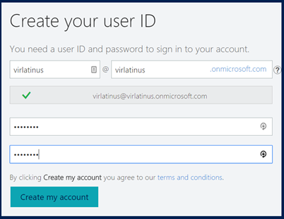
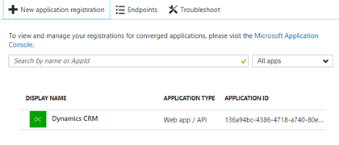
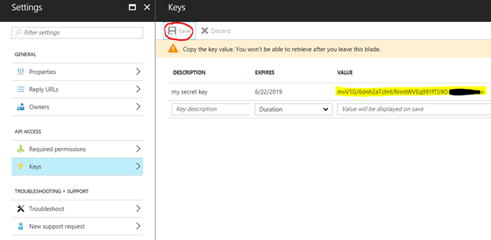
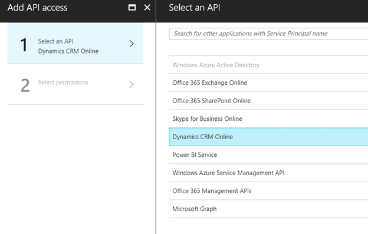
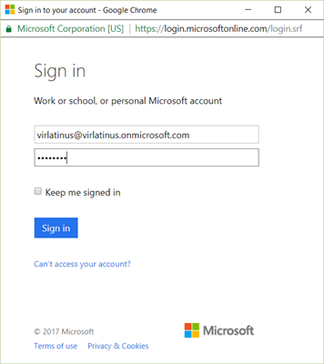

-------------------------

## Mautic - Microsoft Dynamics CRM bi-directional plugin

This plugin can push/pull contacts to and from Dynamics CRM when a contact makes some action and when manually executing the sync leads command.

If you don't have a Dynamics CRM account, follow the instructions below to create a Trial Dynamics 365 account.

## Configure the Dynamics CRM plugin

1. Insert your Dynamics CRM URL, the Application ID and Secret into the Mautic Dynamics integration plugin and authorize it. Set the *Publish* switch to *Yes*. Save.

   

1. Select the features you like in the Features tab. *Push contacts to this integration* checkbox is checked by default.
1. Configure the [field mapping][field mapping].
1. Save the plugin configuration.

## Set Up Dynamics 365

### How to create a Dynamics 365 Trial account

1. Go to the [Dynamics 365 Trial website](https://www.microsoft.com/en-us/free-crm-trial.aspx)

### Set Up Azure

1. Go to the [Azure Portal](https://portal.azure.com)
1. Log in with your onmicrosoft.com account

   

1. Go to Azure Active Directory

   

1. Add a new Application Registration

   

1. Fill in the CRM Application information

   

1. Click on Create
1. Click on the Application you just created

   

1. You will use the Application ID when configuring the plugin in Mautic

   

1. Add a new Key. Use any name, click on save and copy the value. You will use it as the plugin secret in Mautic.

   
   

1. Configure the reply URLs using the callbacks from the plugin settings in Mautic. Click Save

   

1. Configure the Required Permissions. Click on Add

   

1. Add Dynamics CRM Online Api Access. Click Select

   

1. Enable Dynamics CRM access for the users. Click Select and then click Done

   

1. Activate the permissions by clicking "Grant Permissions". Click Yes

   

1. Go back to Mautic
1. Authorize the plugin

   

1. Use your onmicrosoft.com account to authenticate:

   

## Test the plugin

Follow [these steps][testing] to test the integration.

1. The plugin is ready. You can test using "Push to Integration" form and campaign actions.
1. You can also test by executing the command: `php bin/console mautic:integration:fetchleads -i Dynamics`

[mautic]: <https://mautic.org>
[Mautic]: <https://mautic.org>

[field mapping]: <field_mapping.html>
[testing]: <integration_test.html>
[points]: <./../points>
